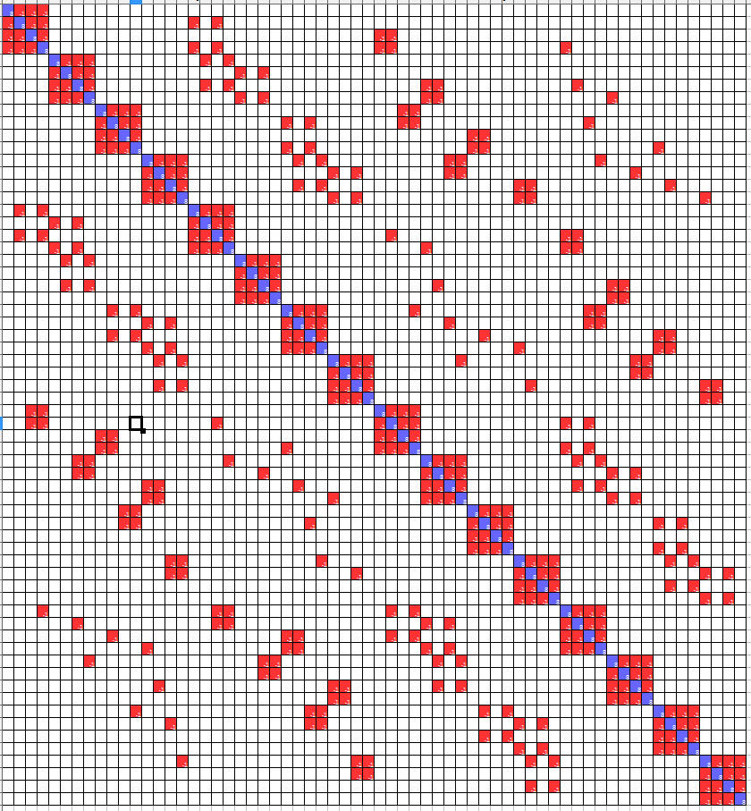
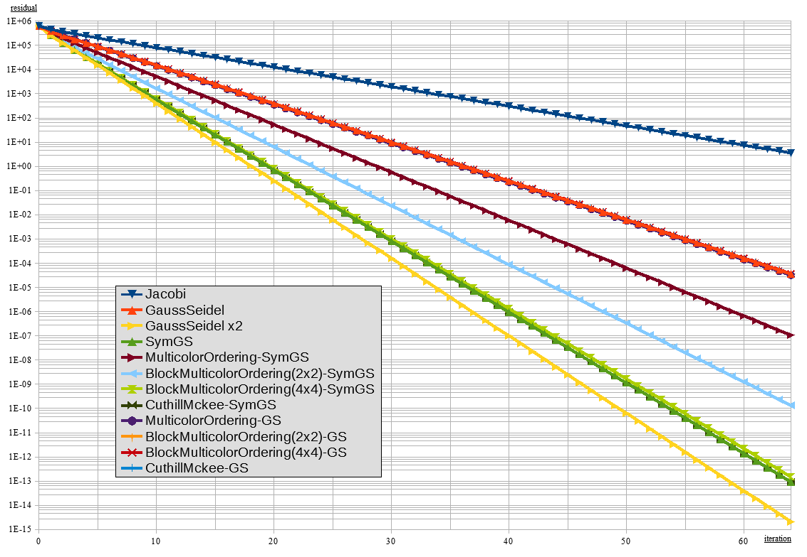

# ABMC
project to learn Algebraic Block Multicolor Ordering

author (attribution)
: LWisteria

URL
: https://github.com/LWisteria

This project is multi-licensed.
You can select the license of your choice from as following:

* [Creative Commons Attribution-ShareAlike 3.0 Unported](http://creativecommons.org/licenses/by-sa/3.0/)
* [Creative Commons Attribution-Noncommercial 3.0 Unported](http://creativecommons.org/licenses/by-nc/3.0/)
* [GNU General Public License v3.0 or later](http://www.gnu.org/licenses/gpl.html)

## Example result

### Matrix
* original matrix 
* (non-block) multicolor ordering 
* block multicolor ordering 

### Gauss-Seidel

